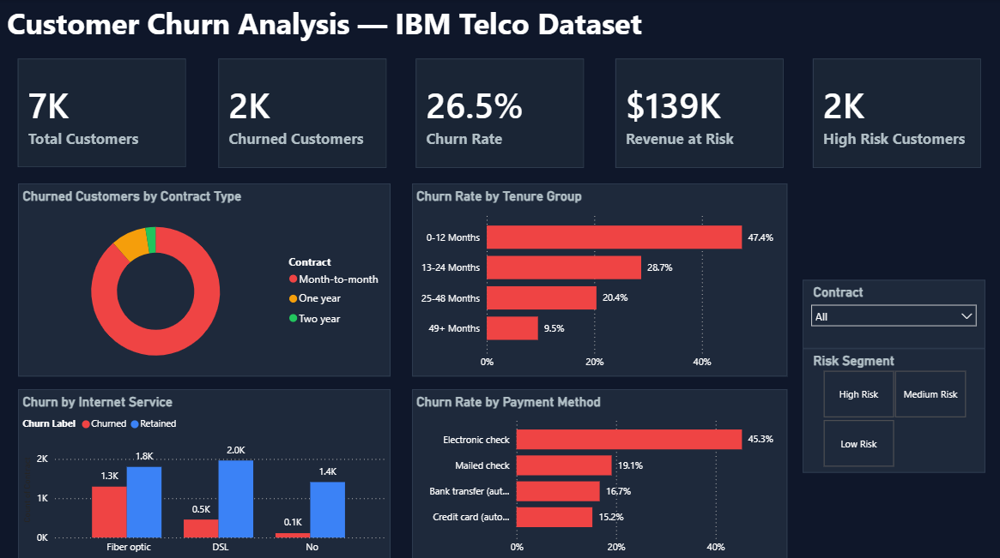
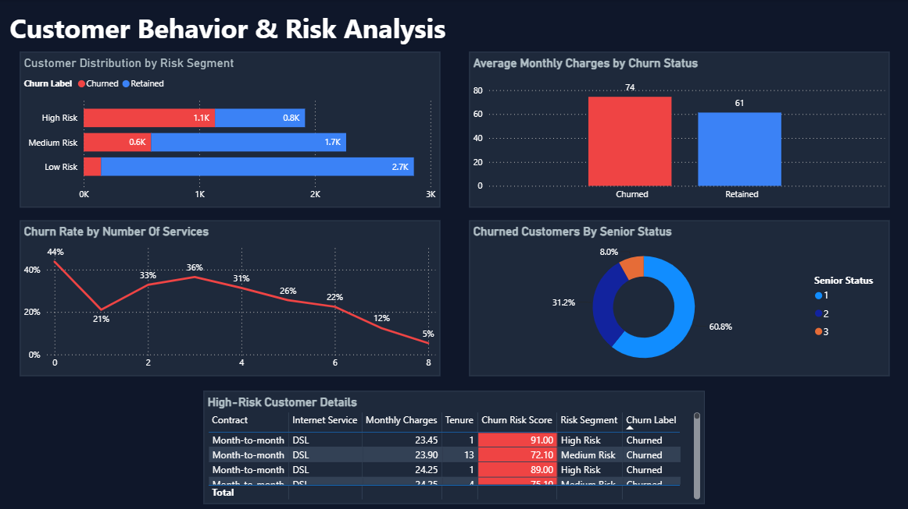

# Customer Churn Analysis & Prediction using XGBoost and Power BI

## Project Overview

This project predicts customer churn using the IBM Telco Customer Churn Dataset and provides business insights through an interactive Power BI dashboard.

The solution combines Machine Learning and Business Intelligence to identify customers at risk of leaving and help organizations improve customer retention strategies.

---

## Business Problem

Customer churn is a major challenge for telecom companies because losing existing customers leads to:

- Revenue loss
- Increased customer acquisition costs
- Reduced customer lifetime value

The objective of this project is to:

- Predict customer churn using Machine Learning
- Identify key churn drivers
- Segment customers by risk level
- Visualize churn patterns through Power BI dashboards

---

## Dataset

**Dataset:** IBM Telco Customer Churn Dataset

### Features

- Customer demographics
- Contract type
- Internet service
- Payment method
- Monthly charges
- Total charges
- Tenure
- Additional telecom services

### Target Variable

- Churn (Retained / Churned)

---

## Project Workflow

### 1. Data Preprocessing

- Missing value handling
- Data cleaning
- Feature encoding using `pd.get_dummies()`
- Feature engineering

### 2. Exploratory Data Analysis (EDA)

- Churn distribution
- Contract analysis
- Internet service analysis
- Payment method analysis
- Tenure analysis

### 3. Feature Engineering

Created additional features:

- TenureGroup
- NumServices
- Churn_Probability
- Churn_Prediction
- Churn_Risk_Score
- RiskSegment

### 4. Model Building

- Train-Test Split
- XGBoost Classifier
- Class imbalance handling using `scale_pos_weight`
- Threshold tuning and evaluation

---

# Machine Learning Model

## Model Used

**XGBoost Classifier**

### Hyperparameters

```python
XGBClassifier(
    n_estimators=100,
    max_depth=4,
    learning_rate=0.1,
    eval_metric='logloss',
    scale_pos_weight=2.77,
    random_state=42
)
```

## Model Performance

| Metric | Score |
|----------|----------|
| Accuracy | 75.23% |
| ROC-AUC | 0.8416 |
| Precision (Churned) | 0.52 |
| Recall (Churned) | 0.80 |
| F1-Score (Churned) | 0.63 |

### Classification Report

| Class | Precision | Recall | F1-Score |
|---------|---------:|---------:|---------:|
| Retained | 0.91 | 0.73 | 0.81 |
| Churned | 0.52 | 0.80 | 0.63 |

### Confusion Matrix

| Actual \\ Predicted | Retained | Churned |
|----------|----------:|----------:|
| Retained | 760 | 275 |
| Churned | 74 | 300 |

### Why Recall Was Prioritized

In churn prediction, identifying customers who are likely to leave is more important than maximizing overall accuracy.

Using `scale_pos_weight = 2.77` improved churn detection and achieved:

- 80% Recall for churned customers
- ROC-AUC of 0.84
- Better identification of at-risk customers

---

# Risk Segmentation

Customers were categorized into risk levels using business rules.

### High Risk

- Month-to-Month Contract
- Fiber Optic Internet
- Electronic Check Payment
- Tenure ≤ 12 Months

### Medium Risk

Customers showing moderate churn indicators.

### Low Risk

Customers showing strong retention characteristics.

---

# Power BI Dashboard

## Page 1 — Executive Churn Overview

### KPIs

- Total Customers
- Churned Customers
- Churn Rate
- Revenue at Risk
- High-Risk Customers

### Visualizations

- Churned Customers by Contract Type
- Churn Rate by Tenure Group
- Churn by Internet Service
- Churn Rate by Payment Method
- Contract Filter
- Risk Segment Filter

### Key Findings

- 88.6% of churned customers are on Month-to-Month contracts.
- Customers with tenure below 12 months have the highest churn rate (47.4%).
- Fiber Optic customers show higher churn volume.
- Electronic Check customers have the highest churn rate (45.3%).

### Dashboard Preview



---

## Page 2 — Customer Behavior & Risk Analysis

### Visualizations

- Customer Distribution by Risk Segment
- Average Monthly Charges by Churn Status
- Churn Rate by Number of Services
- Churned Customers by Senior Status
- High-Risk Customer Details Table

### Key Findings

- High-risk customers are significantly more likely to churn.
- Churned customers pay higher monthly charges on average.
- Customers with more subscribed services churn less frequently.
- Risk segmentation aligns closely with actual churn behavior.

### Dashboard Preview



---

# Repository Structure

```text
Customer-Churn-Analysis
│
├── data
│   ├── WA_Fn-UseC_-Telco-Customer-Churn.csv
│   └── churn_dashboard_data.csv
│
├── notebooks
│   └── Customer_Churn_Prediction.ipynb
│
├── dashboards
│   ├── dashboard_page1.png
│   ├── dashboard_page2.png
│   └── PowerBI_dashboard.pbix
│
└── README.md
```

---

# Tools & Technologies

### Programming

- Python
- Pandas
- NumPy

### Machine Learning

- Scikit-Learn
- XGBoost

### Visualization

- Matplotlib
- Seaborn
- Power BI

### BI Features

- DAX Measures
- Interactive Slicers
- KPI Cards
- Risk Segmentation Dashboard

---

# Business Impact

This solution can help telecom companies:

- Reduce customer churn
- Improve retention campaigns
- Identify high-risk customers early
- Increase customer lifetime value
- Support data-driven decision making

---

## Author

**Afnan Aslam**

Data Science | Machine Learning | Power BI
